# Labs for Intellectual Networks 2020

This is a collection of labs I did for Intellectual Networks 2020 course, which I found fairly interesting, so here they are.
Despite its name, the course was more about Semantic Web and concepts related to it.
Also, these labs are based on ones in the book *Intellectual networks* by Glybovets М.М., Glybovets А.М. and Poliakov М.V.

This README.md file is an edited version of a Google Docs document I created for presenting my labs.

## *Lab 1: "Representation of data in the network"*

### Tasks 1-2

> ***Write a program that compares hexadecimal representations of different text encodings.***

See [tasks1_2.scala](src/main/scala/x74r45/lab1/tasks1_2.scala).

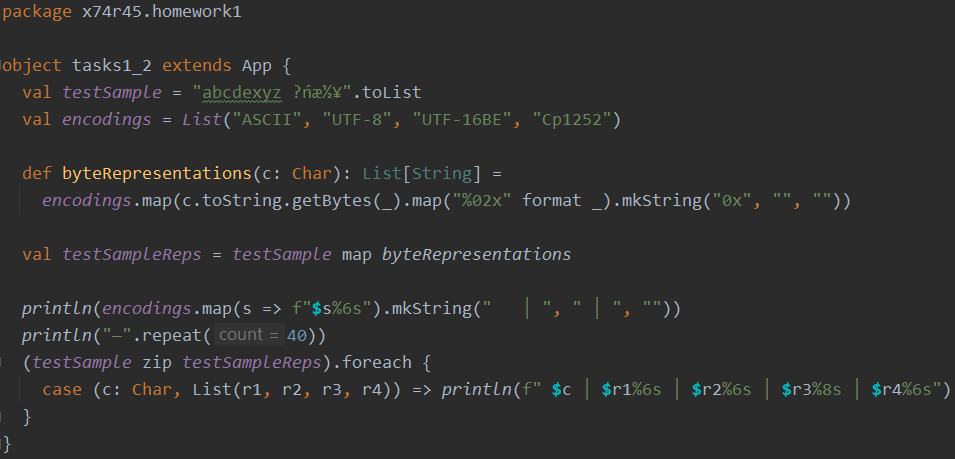

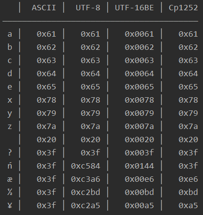

### Tasks 3-4

> ***Read through the following resources and write a summary:***  
> [***http://www.w3.org/TR/cooluris/***](http://www.w3.org/TR/cooluris/)  
> [***http://dbooth.org/2007/uri-decl/***](http://dbooth.org/2007/uri-decl/)  
> [***http://wiki.pro-ibiosphere.eu/wiki/Best_practices_for_stable_URIs/***](http://dbooth.org/2007/uri-decl/)

Two requirements for cool URIs:

1.  Be on the Web: HTTP should be used to make it possible for machines and humans to access the data (RDF or HTML).
2.  Be unambiguous: there should be no confusion between a URI for a webpage and a URI for other resources, such as RDF.

Using URIs, it is possible to identify both a thing (which may exist outside the Web), and a Web document describing the thing.

There are two solutions that meet our requirements for identifying real-world objects: 303 URIs and hash URIs.  
Which one to use depends on the situation, but both have advantages and disadvantages.

***Hash URIs.***

-   used for non-document resources;  
-   URIs can contain a ***fragment***, a special part that is separated from the rest using hashtag ("\#");  
-   less round-trips, therefore less latency;  
-   a URI family can share the same non-hash part;  
-   can't send different data for different hashes, because they are in the same file.

***303 URIs.***

-   using HTTP status code ***303 See Other*** to give an indication that the requested resource is not a regular Web document;  
-   303 is a ***redirect status code***, so the server can give the location of a document that represents the resource. If the status code is in 2XX range, then we know that the URI identifies a web page;  
-   generally more flexible, prettier;  
-   impact on run-time performance and server load.

What Tim Berners-Lee means by "Cool URIs":

1.  ***Simplicity.***  
    Short, mnemonic URIs will not break as easily when sent in emails and are in general easier to remember, e.g. when debugging your Semantic Web server.

2.  ***Stability.***  
    Once you set up a URI to identify a certain resource, it should remain this way as long as possible. Think about the next ten years. Maybe twenty. Keep implementation-specific bits and pieces such as .php and .asp out of your URIs, you may want to change technologies later.

3.  ***Manageability.***  
    Issue your URIs in a way that you can manage. One good practice is to include the current year in the URI path, so that you can change the URI-schema each year without breaking older URIs. Keeping all 303 URIs on a dedicated subdomain, e.g. http://id.example.com/alice, eases later migration of the URI-handling subsystem.

General URI pattern:
**http://subdomain.yourdomain.org/path/variable-identifier**

### Tasks 5-6

***Semantic Web example:
[http://www.ecs.soton.ac.uk/](http://www.ecs.soton.ac.uk/)***

Retrieve information about Wendy Hall:

-   [http://id.ecs.soton.ac.uk/person/1650](http://id.ecs.soton.ac.uk/person/1650)  
    -\> 404 Not Found: The requested URL /person/1650 was not found on this
server.

-   [http://www.ecs.soton.ac.uk/people/wh](http://www.ecs.soton.ac.uk/people/wh)  
    -\> publications, contact; using hash URIs.

-   [http://rdf.ecs.soton.ac.uk/person/1650](http://rdf.ecs.soton.ac.uk/person/1650)  
    -\> 404 Not Found: The requested URL /person/1650 was not found on this server.

### Task 7

> ***Choose a website and describe some of its components with URI.***

See [wired-sitemap.xml](src/main/scala/x74r45/lab1/wired-sitemap.xml).

Turns out you can search for existing sitemaps this way:  
[https://www.google.com/#q=inurl%3Asitemap+filetype%3Axml](https://www.google.com/#q=inurl%3Asitemap+filetype%3Axml)


[https://www.wired.com/sitemap.xml](https://www.wired.com/sitemap.xml)

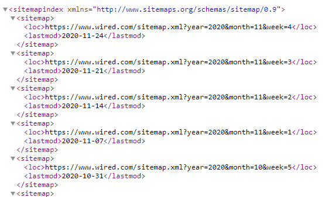

[https://www.wired.com/sitemap.xml?year=2020&month=11&week=4](https://www.wired.com/sitemap.xml?year=2020&month=11&week=4)

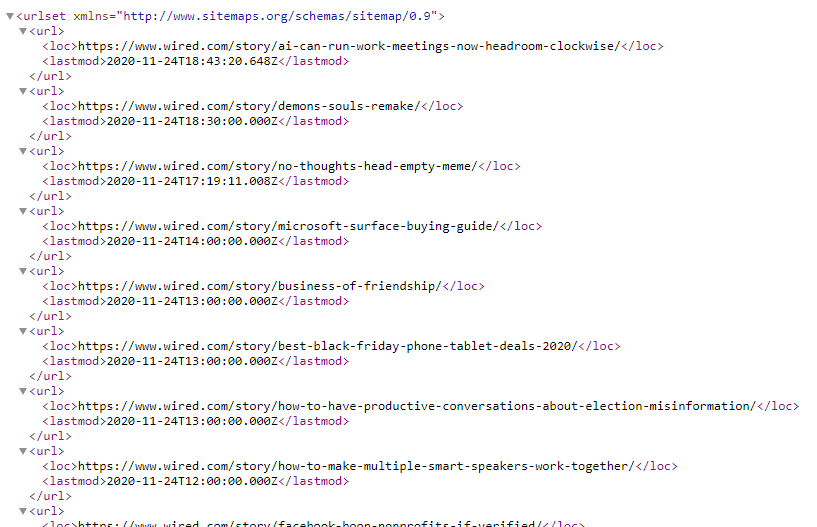

### Tasks 8-10

> ***Write an XML document and its scheme that represents a simple library.***

See [books-schema.xsd](src/main/scala/x74r45/lab1/books-schema.xsd) and
[books.xml](src/main/scala/x74r45/lab1/books.xml).

## *Lab 2: "Representation of metatdata in the network: RDF, RDFS"*

### Tasks 1-2

> ***Learn how to serialize an RDF-graph using Turtle syntax.***  
> ***Describe the following graph using Turtle:***
> 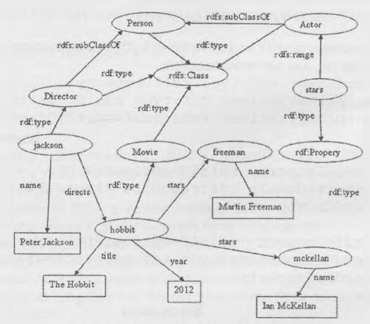

Turtle code is made up of triples.

An RDF triple contains three components:
-   the subject, which is an [RDF URI reference](https://www.w3.org/TR/rdf-concepts/#dfn-URI-reference)
    or a [blank node](https://www.w3.org/TR/rdf-concepts/#dfn-blank-node);  
-   the predicate, which is an [RDF URI reference](https://www.w3.org/TR/rdf-concepts/#dfn-URI-reference);  
-   the object, which is an [RDF URI reference](https://www.w3.org/TR/rdf-concepts/#dfn-URI-reference),
    a [literal](https://www.w3.org/TR/rdf-concepts/#dfn-literal) or a
    [blank node](https://www.w3.org/TR/rdf-concepts/#dfn-blank-node).

See [task2.ttl](src/main/scala/x74r45/lab2/task2.ttl).

I used [https://www.w3.org/2015/03/ShExValidata/](https://www.w3.org/2015/03/ShExValidata/) to validate my code:

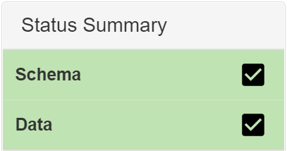

### Tasks 3-4

> ***Choose an online article and describe it using RDF/XML and Dublin Core terms.***  
> ***Verify it with an RDF/XML validator.***

The [link](http://dublincore.org/documents/2012/06/14/dcmiterms/?v=terms) to Dublin Core terms
that's specified in the book is broken, so I found the updated link
[here](https://www.dublincore.org/specifications/dublin-core/dcmi-terms/).

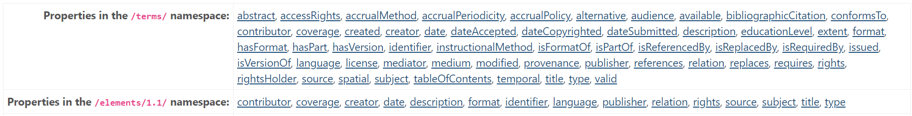

There, I could find all the terms and elements that are available in
DCMI. I looked through them and chose ones I thought were suitable. See [task3.xml](src/main/scala/x74r45/lab2/task3.xml).

RDF/XML validator: [http://www.w3.org/RDF/Validator/](http://www.w3.org/RDF/Validator/)

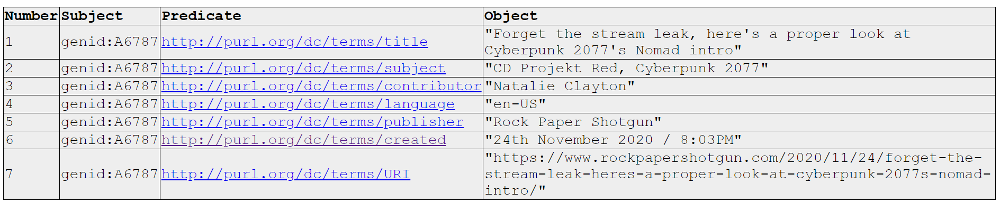

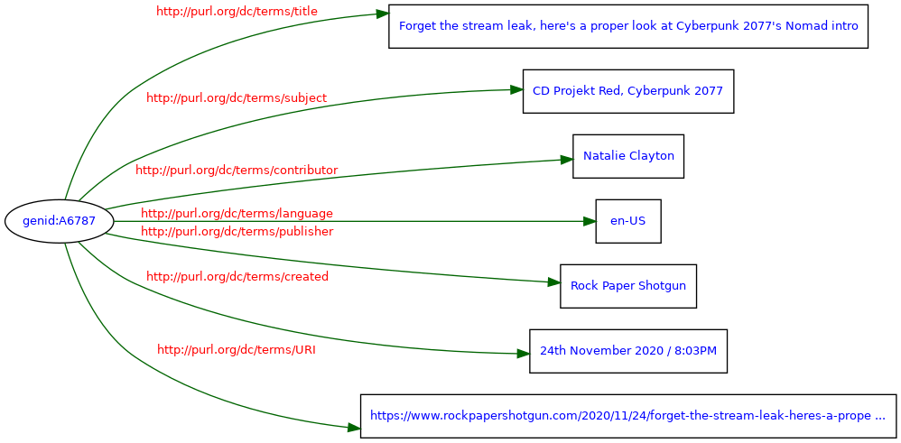

### Task 5

> ***Read the text and describe it using RDF/XML:  
> "Private primary school № 157 has three employees: two teachers (Olena Gennadiyivna, Dmytro Olehovych)
> and the director Oleksandr Petrovych. In addition to administrative functions, the director also teaches.
> Olena Gennadiyivna teaches in the first grade, Dmytro Olehovych and Oleksandr Petrovych both teach in the
> second and third grades. Dmytro Olehovych specializes in sports and, therefore, teaches PE in the third
> grade. There is at least one student in each class."***

See [task5.xml](src/main/scala/x74r45/lab2/task5.xml).

## *Lab 3: "Graph databases"*

The most popular GDBs are Neo4j, HyperGraphDB, InfoGrid, AllegroGraph.
Let's look into Neo4j.

Firstly, I opened the example DB and ran the Cypher script to
initialize the data. The beginning of the script looked like this:

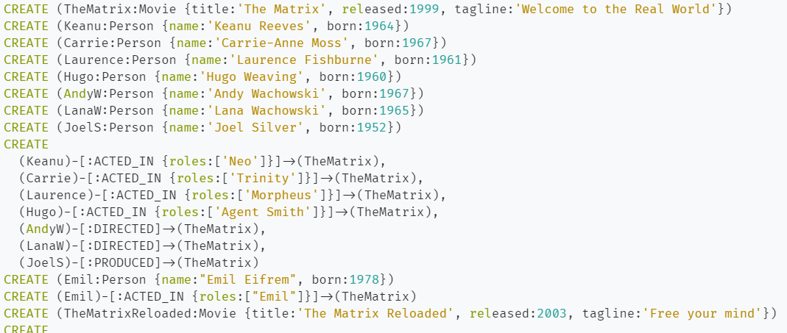

The result is the following graph database of movies and actors.

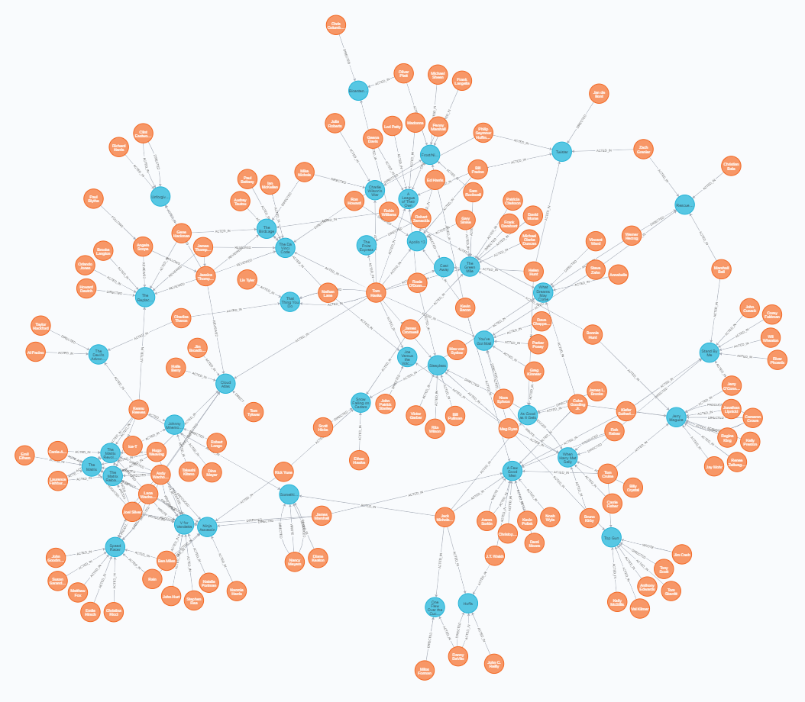

### Task 1

> ***Create a simple graph database of a social media containing an entity "User"
> and relationships "friends".***

Creating the DB.

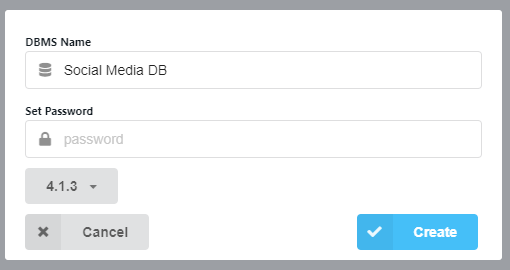

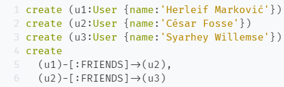

The result is the following:

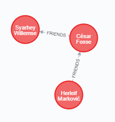

### Tasks 2-3

> ***Fill the database with more Users and friends using Java API.***

Using the Neo4j Java Driver, I filled the DB with users (and
relationships between them). (See [FillSocialDatabase.java](src/main/scala/x74r45/lab3/FillSocialDatabase.java))

We end up with the following DB:

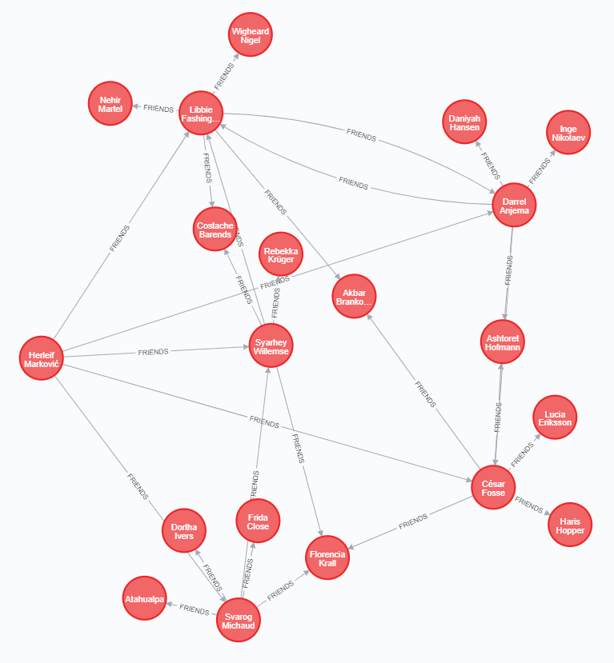

### Task 4

> ***Using the Cypher language, write a query for finding "friends of friends".***

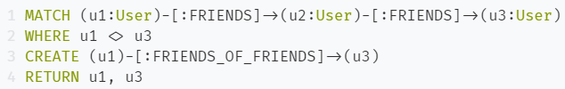

This query results in the following:

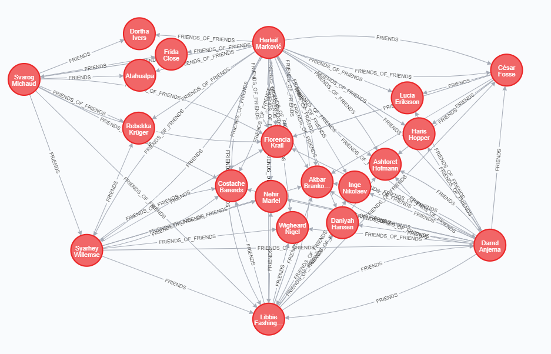

## *Lab 4: "Representation of knowledge in ontologies, OWL"*

Ontologies describe the knowledge about a given domain. The parts of an
ontology are individuals, classes, attributes and relations.

### Task 1

> ***Try using ontology editors Protege, Neon and Hozo. Analyze their functionality and
write short reviews.***

Downloaded ontology editors from here:  
[https://protege.stanford.edu/products.php\#desktop-protege](https://protege.stanford.edu/products.php#desktop-protege)  
[http://neon-toolkit.org/wiki/Download/2.5.2.html](http://neon-toolkit.org/wiki/Download/2.5.2.html)  
[http://hozo.jp/download_en.php](http://hozo.jp/download_en.php)

-   ***Protege***

    Protege is, in fact, the most widely used Ontology Editor (OE) as of
today, therefore it doesn't come off as a surprise that it gets
updates fairly regularly. In general, it has dedicated tabs for
entities, classes, individuals and some others, which, in my opinion, is
a very good design choice, since it allows the user to focus on
different things, depending on what is suitable at the moment.

    Overall, I would say that the UI is very intuitive and
rich in functionality at the same time.

    In addition to that, the OntoGraf tool provides a nice way to visualize
the ontology.

-   ***NeOn Toolkit***

    This piece of software has been abandoned 9 years ago, which makes the
installation (and usage) more and more difficult and problematic as the
time progresses. For example, you must have pre-installed Java 8 to use
it; having a higher version would crash the application at the startup.

    Other than that, I would say that it is very easy to understand once you
open it up. Everything is kept fairly simple, dividing the navigator and
properties tabs from everything else.

    Sadly, I could not find a way to visualize the ontology, though there
are a number of plugins that could potentially provide that functionality.

-   ***Hozo OE***

    Hozo is a very interesting Japanese tool for managing ontologies, which,
to my surprise, is still supported and updated quite regularly.

    This software is actually very different from the other ones I've seen
so far. It has a navigation tree and information tabs on the left, much
like in NeOn, but on the right you will always see a visual
representation of the ontology you're working on. I would say it's a
good thing, because always having the ontology in front of you in its
entirety sure does help to stay focused, even after being distracted by
a family member while working from home during quarantine.

    The tool also provides a way to print the ontology graph to PDF.

    The downside of Hozo is that it has its own XML ontology format, which
doesn't match with OWL/RDF.

### Task 2

> ***Use Protege to create a small ontology that represents a repository of scientific materials.***

I used [sciencedirect.com](https://www.sciencedirect.com/browse/journals-and-books/v?subject=computer-science)
as a source of information about various scientific materials.

See [scientificMaterials.owl](src/main/scala/x74r45/lab4/scientificMaterials.owl).

The graph of the resulting ontology looks like this:

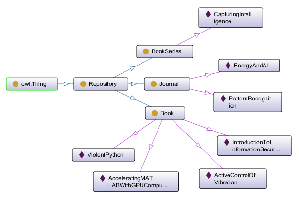

## *Lab 5: "Rule Interchange Format (RIF)"*

RIF contains head and body, where body is a rule for the head. There are different dialects:

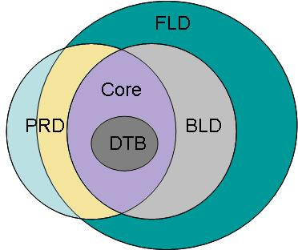

Syntax of different dialects can be found here:  
[https://www.w3.org/TR/rif-overview/](https://www.w3.org/TR/rif-overview/)

### Tasks 1-4

> ***Create the following RIF rules:***
> -  ***"Every human is mortal";***
> -  ***"If Socrates is a human, then he is mortal";***
> -  ***"Every human is mortal, Socrates is a human".***
>
> ***Create 5-7 RIF rules for a previously created OWL ontology.***

See [task1.rif](src/main/scala/x74r45/lab5/task1.rif), 
[task2.rif](src/main/scala/x74r45/lab5/task2.rif), 
[task3.rif](src/main/scala/x74r45/lab5/task3.rif) and 
[task4.rif](src/main/scala/x74r45/lab5/task4.rif).

## *Lab 6: "Semantic Wikis"*

Requirements for systems of collective and personal organization of knowledge:  
-   Support for collective access. (hierarchical structure of access rights)  
-   Support for network interaction. (e.g. Intranet)  
-   Hypertext support.  
-   Support for easy editing process. (for example, WYSIWYG editor)  
-   Support for downloading files of various formats and linking them to a specific topic.  
-   Support for version control.


Most of the disadvantages of standard wikis are manifested with an increase in the number of articles.
What they start lacking in is:  
-   consistency of content (due to frequent duplication of data);  
-   access to the knowledge contained in the wiki (it is very difficult to make a sample of the necessary information from a large number of pages);  
-   reuse of wiki knowledge (it is possible to use only the plain text of the article without the possibility of constructing additional records);  
-   use of categories, tags, namespaces (there is no possibility to use typed properties, classification is complicated).

The **social web** consists of blogs, wikis, multimedia content sites, tags,
social networks. Such information is clear to people, but due
to the lack of structure, it is virtually inaccessible to machines.

The purpose of **semantic wikis** is to combine the social web and the
semantic web, extending the traditional wiki with semantic principles
(RDF/OWL/graphs, etc.). This is most often achieved by annotating
links with text that describes their meaning.

### Task 1

> ***Choose a Semantic Wiki, research it, and write a review on it.***

***Kaukolu***

Kaukolu is a semantic wiki research prototype used as a testbed for
alternative approaches of mapping wiki contents to a knowledge base.
While most semantic wikis identify pages with (RDF) resources and links
between pages with (RDF) predicates, Kaukolu implements an indirection
layer between the wiki page model and the RDF model.

RDF resources can get created (and may be \'attached\' to sections of
text), forming annotations. Users can navigate both in the standard wiki
world and the layer formed by annotations, switching between both views
as needed. This is particularly handy when dealing with existing texts
(e.g., text migrated from normal wikis or texts imported from somewhere
else).

Features it includes:  
-   Java  
-   JSPWiki  
-   Subject Attribution: any (any URI)  
-   Subject Granularity: sentence (actually any URI/wiki page section)  
-   Representation distinction: true  
-   Terminology reuse: true  
-   Object type: any  
-   Context: true  
-   Import RDF: true  
-   Import RDFS: true  
-   Export RDF: true

References:  
[https://web.archive.org/web/20120103123502/http://semanticweb.org/wiki/Kaukolu](https://web.archive.org/web/20120103123502/http://semanticweb.org/wiki/Kaukolu);  
[http://kaukoluwiki.opendfki.de/](http://kaukoluwiki.opendfki.de/).

## *Lab 7: "Data mining"*

Data Mining is the process of studying and detecting "hidden knowledge"
by a "machine" (algorithms, artificial intelligence) in raw data.

Data mining methods help solve a variety of problems that analysts face.
Of these tasks, the main ones are classification, regression, search and clustering.

The Web Mining process can be described as a non-trivial process of
identifying reliable, hitherto unknown and potentially useful knowledge
and associations in the vast expanses of web knowledge.

### Tasks 1-2

> ***The goal of this lab is to gain practical skills of deploying and using a data mining platform.
> You will need to do the following steps:***
> - ***install Apache Hadoop;***
> - ***install Apache Mahout;***
> - ***download the dataset from [here](http://www.grouplens.org/system/files/ml-100k.zip);***
> - ***use Apache Mahout to process the data using the following command (or alike):***
> ```
> hadoop jar mahout-core-0.8-job.jar org.apache.mahout.cf.taste.hadoop.item.RecommenderJob -s SIMILARITY_COOCCURRENCE --input u.data --output output
> ```  
> - ***use [script.py](src/main/scala/x74r45/lab7/script.py) to convert the result into useful knowledge.***

Firstly, I followed the tutorial in this link to install Apache Hadoop:  
[https://www.datasciencecentral.com/profiles/blogs/how-to-install-and-run-hadoop-on-windows-for-beginners](https://www.datasciencecentral.com/profiles/blogs/how-to-install-and-run-hadoop-on-windows-for-beginners)

Secondly, I downloaded Apache Mahout and the dataset, put the data inside the HDFS and executed the command:

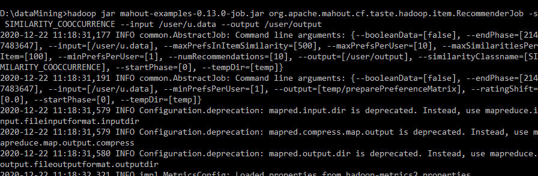

After getting the result out of HDFS, we get [output.txt](src/main/scala/x74r45/lab7/output.txt).  
I couldn't figure out how to use [script.py](src/main/scala/x74r45/lab7/script.py) to convert the resulting data, so I left it here.
